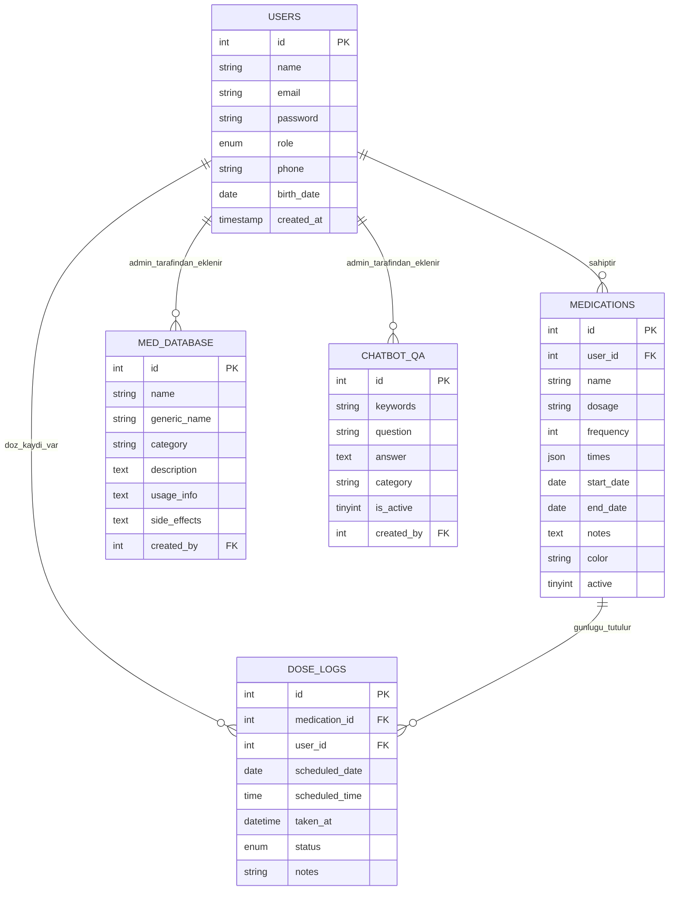

# Panacea Care: Akıllı İlaç Takip Sistemi - Tez Taslağı ve Rehberi

Bu dosya, **Panacea Care (Akıllı İlaç Takip Sistemi)** bitirme projesi tezinizi yazarken size yol göstermek amacıyla hazırlanmış detaylı bir tez taslağı ve içerik rehberidir. Üniversitelerin mühendislik/teknoloji fakültesi bitirme projesi yazım kılavuzlarına uygun olarak yapılandırılmıştır.

---

## 📋 TEZ BÖLÜM YAPISI VE İÇERİK PLANI

Tezinizi genel olarak 6 veya 7 ana bölüm altında toplayabilirsiniz. Aşağıda her bir bölümün başlığı, ne içermesi gerektiği ve projenizden hangi dosyaları/teknolojileri referans göstereceğiniz açıklanmıştır.

### BÖLÜM 1: GİRİŞ (INTRODUCTION)
*   **1.1. Projenin Amacı ve Önemi:** 
    *   İlaç uyumsuzluğunun (ilaçları zamanında almama/unutma) küresel sağlık üzerindeki olumsuz etkilerini açıklayın (Dünya Sağlık Örgütü verilerine atıfta bulunabilirsiniz).
    *   Panacea Care'in bu probleme nasıl bir çözüm sunduğunu belirtin (kişiselleştirilmiş hatırlatıcılar, chatbot ile anında bilgi erişimi, istatistiksel analizler).
*   **1.2. Problemin Tanımı:** 
    *   Kronik hastaların ve yaşlıların çoklu ilaç kullanımlarında yaşadıkları zorluklar.
    *   Tıbbi bilgilere (yan etkiler, etkileşimler vb.) güvenilir ve hızlı erişim eksikliği.
*   **1.3. Kapsam ve Sınırlar:** 
    *   Geliştirilen sistemin web tabanlı olması, kullanıcı ve admin panelleri içermesi, lokal bir yapay zeka (Ollama / Gemma) ile entegre olması.
    *   *Sınırlar:* Mobil uygulamanın bulunmaması (web tarayıcı odaklı olması), hastanelerle doğrudan entegrasyon olmaması.

### BÖLÜM 2: LİTERATÜR TARAMASI VE BENZER SİSTEMLER
*   **2.1. İlaç Takip Uygulamaları:** Medisafe, MyTherapy gibi piyasadaki popüler uygulamaların analizi. Bunların güçlü ve zayıf yönleri (Genellikle mobil olmaları, web arayüzlerinin zayıf olması, kişiselleştirilmiş yerel yapay zeka asistanlarının eksikliği).
*   **2.2. Sağlık Sektöründe Yapay Zeka ve Chatbotlar:** Yapay zekanın sağlık danışmanlığındaki rolü ve yerel (local LLM) modellerin veri gizliliği açısından önemi.

### BÖLÜM 3: GEREKSİNİM ANALİZİ VE SİSTEM TASARIMI
*   **3.1. Fonksiyonel Gereksinimler (Functional Requirements):**
    *   **Kullanıcı Rolü:** Üye olma, giriş yapma, ilaç ekleme (doz, sıklık, saatler, tarih aralığı), doz takibi yapma (alındı/atlanıldı olarak işaretleme), istatistikleri görüntüleme, sağlık asistanı ile sohbet etme, profil güncelleme.
    *   **Yönetici (Admin) Rolü:** Sistemdeki kullanıcıları yönetme, ilaç veritabanını güncelleme, chatbot için statik soru-cevap veri bankasını yönetme.
*   **3.2. Fonksiyonel Olmayan Gereksinimler (Non-Functional Requirements):**
    *   **Güvenlik:** Parolaların bcrypt ile hashlenmesi, CSRF koruması, veri tabanı sorgularında SQL injection önlenmesi (PDO Prepared Statements).
    *   **Kullanılabilirlik (Usability):** Karanlık/Aydınlık tema desteği, mobil uyumlu (responsive) tasarım.
    *   **Performans:** Veritabanında sık sorgulanan alanlarda index kullanımı (`idx_medications_user`, `idx_dose_logs_user_date` vb.).
*   **3.3. Veritabanı Mimarisi (Entity-Relationship Diagram):**
    Veritabanındaki tabloları ve aralarındaki ilişkileri açıklayın. (Aşağıdaki Mermaid diyagramını tezinize aktarabilirsiniz).

### BÖLÜM 4: SİSTEM GERÇEKLEŞTİRİMİ (IMPLEMENTATION)
Bu bölümde kullandığınız yazılım teknolojilerini ve kod yapınızı detaylandırın.
*   **4.1. Kullanılan Teknolojiler:**
    *   **Sunucu Tarafı (Backend):** PHP (sürüm 8.x), PDO (PHP Data Objects).
    *   **Veritabanı (Database):** MySQL.
    *   **İstemci Tarafı (Frontend):** HTML5, CSS3 (Modern değişkenler ile Dark/Light tema yönetimi), Vanilla Javascript.
    *   **Grafik Kütüphanesi:** Chart.js (İlaç uyum oranlarını dinamik grafiklerle görselleştirmek için).
    *   **Yapay Zeka:** Ollama (Lokal LLM motoru) ve `gemma4` (ya da Gemma serisi) dil modeli.
*   **4.2. Önemli Modüllerin Kod Analizi:**
    *   **İlaç Saatlerinin JSON Olarak Saklanması:** İlaç saatlerinin `medications` tablosunda `JSON` formatında (`times` alanı) saklanması mimaride esneklik sağlar. PHP tarafında `json_encode` ve `json_decode` ile işlenir.
    *   **Yapay Zeka Entegrasyonu (Ollama API):** [api/chatbot.php](file:///c:/xampp/htdocs/bitirme-projesi/api/chatbot.php) dosyası üzerinden yerel yapay zeka servisine cURL istekleri gönderilir. Sistem promptu tanımlanarak yapay zekaya bir "Sağlık ve Eczacılık Asistanı" rolü (System Prompt) atanmıştır. Modelin çıktıları (`<think>` etiketleri temizlenerek) sanitize edilir.
    *   **Tema Yönetimi:** [header.php](file:///c:/xampp/htdocs/bitirme-projesi/includes/header.php#L24-L30)'de sayfa render edilmeden önce `localStorage`'dan okunan değer ile sayfa titremesi (flash) engellenerek tema yüklenir.

### BÖLÜM 5: TEST VE VERİLER
*   **5.1. Veritabanı Kurulumu ve Örnek Veriler:**
    *   [setup.php](file:///c:/xampp/htdocs/bitirme-projesi/setup.php) dosyasının sistemi sıfırdan nasıl ayağa kaldırdığını (tabloların otomatik oluşması, indexlerin tanımlanması ve test kullanıcıları ile örnek ilaç/chatbot verilerinin eklenmesi) anlatın.
*   **5.2. Test Senaryoları:**
    *   Kullanıcı kaydı ve giriş testi (şifre doğrulama).
    *   Kullanıcının ilaç eklemesi ve ilgili tarihler için `dose_logs` tablosunda otomatik doz planlarının oluşturulması.
    *   Dozların "alındı" olarak işaretlenmesiyle istatistik grafiklerinin güncellenmesi.
    *   Chatbot'un hem kullanıcının kendi ilaç bilgilerini listelemesi ("ilaçlarım") hem de Ollama LLM üzerinden genel sağlık sorularını cevaplama testleri.

### BÖLÜM 6: SONUÇ VE GELECEK ÇALIŞMALAR
*   **6.1. Elde Edilen Kazanımlar:**
    *   Güvenli, hızlı ve kullanıcı dostu bir ilaç yönetim platformunun yerel yapay zeka entegrasyonuyla başarıyla kurulması.
*   **6.2. Gelecekte Yapılabilecek Geliştirmeler (Future Work):**
    *   Mobil bildirimler (Web Push Notification veya mobil uygulama) entegrasyonu.
    *   Kullanıcının reçete fotoğrafını yükleyerek (OCR ve Yapay Görme kullanarak) sisteme otomatik ilaç ekleyebilmesi.
    *   E-Nabız sistemiyle entegrasyon sağlanarak reçete edilen ilaçların otomatik çekilmesi.

---

## ✍️ TEZ YAZARKEN DİKKAT ETMENİZ GEREKENLER (ALTIN KURALLAR)

1.  **Akademik Dil Kullanın:** 
    *   "Yaptım, yazdım, ekledik" gibi birinci şahıs ifadeleri yerine edilgen çatılı cümleler kurun. 
    *   *Örnek:* "Projeyi PHP ile geliştirdik." ❌ 
    *   *Örnek:* "Sistem, sunucu tarafında PHP dili kullanılarak geliştirilmiştir."  (Doğru)
2.  **Kaynak Gösterimi (Referanslar):**
    *   Kullandığınız kütüphaneleri (örn. Chart.js), dil modellerini (Ollama, Google Gemma) ve veritabanı teknolojilerini mutlaka kaynakçada belirtin.
    *   Dünya Sağlık Örgütü'nün (WHO) ilaç kullanımı uyumsuzluğu ile ilgili istatistiki raporlarını giriş bölümünde kaynak olarak gösterin.
3.  **Görsel ve Ekran Görüntüleri:**
    *   Tezin "Gerçekleştirim" ve "Test" bölümlerine sistemin ekran görüntülerini (Dashboard, İlaç Ekleme ekranı, Chatbot sohbeti, İstatistik grafikleri) ekleyin. Ekran görüntülerinin altına mutlaka "Şekil 4.1: Panacea Care Kullanıcı Paneli" gibi başlıklar yazın.
4.  **Kod Blokları:**
    *   Tezin içerisine kilometrelerce kod yapıştırmayın. Sadece en önemli algoritmaları (örneğin Ollama cURL isteğini yaptığınız [api/chatbot.php](file:///c:/xampp/htdocs/bitirme-projesi/api/chatbot.php)'deki API bağlantı metodunu veya veritabanı ilişkilerini kuran SQL yapısını) kısa kod blokları veya akış şemaları halinde ekleyin.
